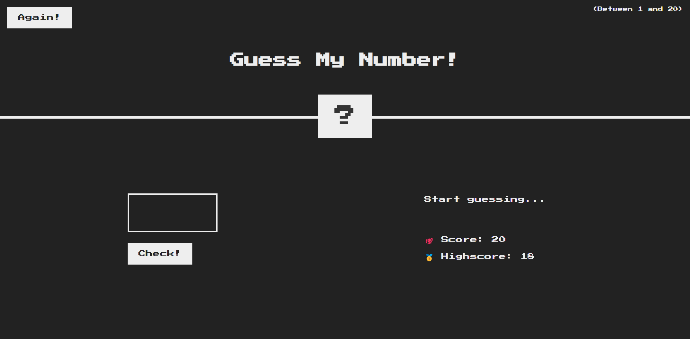

# 🎯 Guess My Number Game (TypeScript + MVC)

A simple number guessing game built with **TypeScript**, following the **MVC (Model-View-Controller)** architectural pattern. The user tries to guess a random number between 1 and 20. This project was created for learning purposes — focusing on clean code, TypeScript typing, and modular architecture.

---

## 🛠️ Technologies Used

- **TypeScript** — for static typing and cleaner code structure.
- **HTML + CSS** — for the UI.
- **ES6 JavaScript Modules** — for modular development.
- **MVC Architecture** — to separate concerns between logic and UI.

---

## 📁 Project Structure

📦guess-my-number-ts-mvc
├── 📄 index.html
├── 📄 style.css
├── 📁 src
│ ├── config.ts # Game configuration (min, max, score)
│ ├── controller.ts # Connects model with view (game logic)
│ ├── helper.ts # Utility functions (e.g., random number generator)
│ ├── model.ts # Game logic and state management
│ ├── types.ts # Type definitions (State interface)
│ └── view.ts # Handles DOM interaction and rendering
├── 📁 assets
│ └── screenshot.png
└── 📄 README.md

---

## 🎮 How to Play

1. Enter a number between 1 and 20.
2. The game compares your guess to a randomly generated number.
3. You’ll get one of the following messages:
   - 📉 "Too low!" if your guess is too low.
   - 📈 "Too high!" if it’s too high.
   - 🎉 "Correct!" if you guessed the number.
4. Your score decreases with each wrong guess.
5. If your score reaches 0, you lose 💥.
6. Click "Again" to restart the game.

---

## 🌟 Features

- ✅ Random number generation.
- ✅ Score and highscore tracking.
- ✅ Persistent state using `localStorage`.
- ✅ Fully written in TypeScript.
- ✅ Clean MVC structure.

---

## 💡 Potential Future Improvements

- Add light/dark mode toggle.
- Improve UX after win or loss.
- Store highscore separately from game state.
- Mobile UI enhancements.
- Add sound effects on win/loss.

---

## 🙌 Personal Effort

This project was fully developed as a learning exercise to improve:

- Writing modular and clean TypeScript code.
- Implementing the MVC design pattern.
- Handling browser storage via `localStorage`.
- Designing a simple yet functional user interface.

---

## 🧠 Key Takeaways

- The power of separating logic and UI for better code maintenance.
- Practical use of TypeScript interfaces and types.
- Real-world experience with state persistence using local storage.
- Better understanding of DOM manipulation within a structured architecture.

---

## 📷 Screenshot

---

## 🔗 Live Demo

Check out the live version here: [👉 Play Now](https://guess-my-number-mvc-ts.netlify.app)

---

## 📄 License

MIT License — Free to use and modify for educational or personal use.
